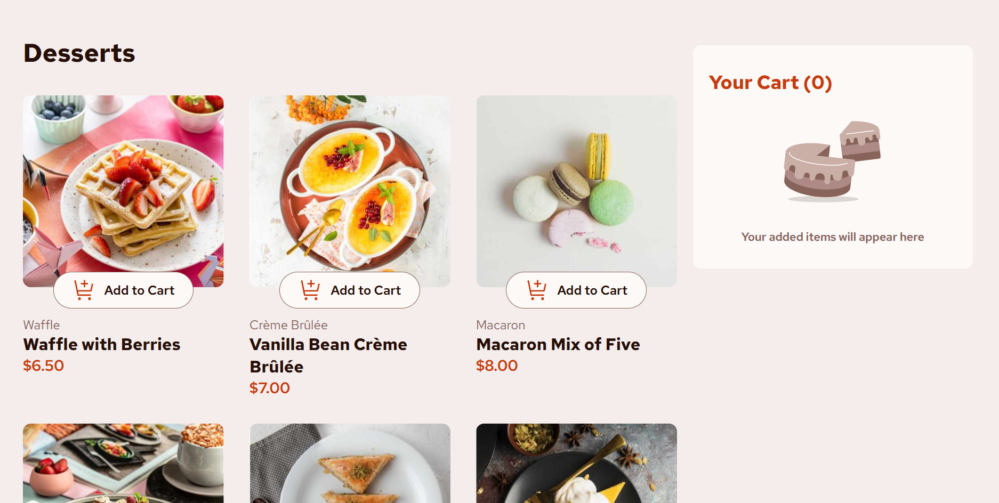

# Frontend Mentor - Product list with cart solution

This is my solution to the [Product list with cart challenge on Frontend Mentor](https://www.frontendmentor.io/challenges/product-list-with-cart-5MmqLVAp_d). Frontend Mentor challenges help you improve your coding skills by building realistic projects.

## Table of contents

- [Overview](#overview)
  - [The challenge](#the-challenge)
  - [Screenshot](#screenshot)
  - [Links](#links)
- [My process](#my-process)
  - [Built with](#built-with)
  - [What I learned](#what-i-learned)
  - [Continued development](#continued-development)
  - [Useful resources](#useful-resources)
- [Author](#author)
- [Acknowledgments](#acknowledgments)

## Overview

### The challenge

The goal of this project was to build a responsive product list with a fully functional shopping cart.Users should be able to:

- Add items to the cart and remove them
- Increase/decrease the number of items in the cart
- See an order confirmation modal when they click "Confirm Order"
- Reset their selections when they click "Start New Order"
- View the optimal layout for the interface depending on their device's screen size
- See hover and focus states for all interactive elements on the page

### Screenshot



### Links

- Solution URL: [Github Solution](https://github.com/WesSno/Product-List-With-Cart)
- Live Site URL: [Live Demo](https://kbk-product-list-with-cart.netlify.app/)

## My process

### Built with

- JavaScript for interactive cart functionality
- CSS Grid and Flexbox for responsive layouts
- Mobile-first workflow
- [React](https://reactjs.org/) - JS library for building user interfaces

### What I learned

This project helped me deepen my understanding of:

- **React State Management:** Using `useState` to handle cart items, quantities, and modal visibility.
- **Conditional Rendering:** Showing different UI states such as the "Add to Cart" button, quantity controls, and other order confirmation modal.
- **Array Methods in JS:** Using `.map()`, `.find()`, `.filter()`, and `.reduce()` to manipulate cart data dynamically.
- **CSS for UI/UX:** Styling components for responsiveness, hover effects, and truncating long item names with ellipsis (`text-overflow: ellipsis`).
- **Preventing Background Scrolling:** Locking the page scroll when the modal is open using `document.body.style.overflow`.

Example of truncating long product names:

```css
.confirmed-item-info .name {
  max-width: 150px;
  white-space: nowrap;
  overflow: hidden;
  text-overflow: ellipsis;
}
```

### Continued development

In future projects, I want to:

- Add _localStorage persistence_ so the cart retains items even after page reload.

### Useful resources

- [Frontend Mentor](https://www.frontendmentor.io/) - For challenge inspiration and guidance

## Author

- Website - [Kofi Baafi Kwatia](https://github.com/WesSno)
- Frontend Mentor - [@WesSno](https://www.frontendmentor.io/profile/WesSno)

## Acknowledgments

Thanks to Frontend Mentor for providing the challenge and design files that guided this project. This project was completed independently.
